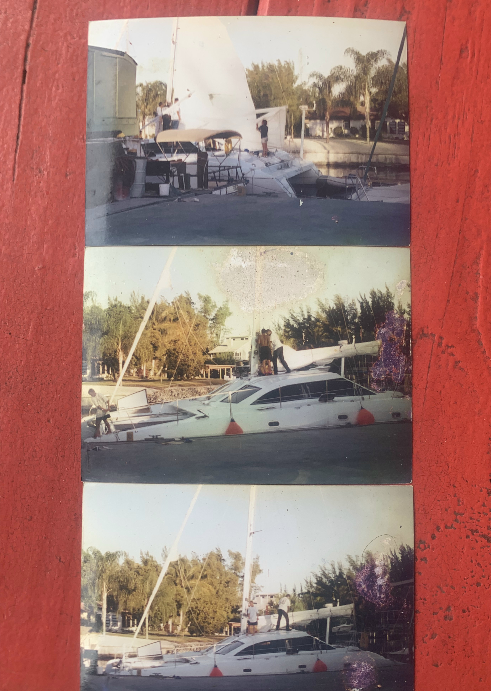

# Jim again

Saw Jim again today, the old captain that used to skipper my boat when she was young.
He said he had some photos to show from those days, so I went to the bar where he likes to hang out, and he’s shown me three pictures
where you could see how the sail was set on her.  That should help me at least a little bit when I’m ready to depart for my next destination.

He’s also shown me pictures of the trimaran that he built that he currently lives on, told some stories about his past adventures.  Then we talked about trimarans for a bit, apparently he sailed on a 1984 Shuttleworth 42’ trimaran called Damiana.  She’s right now for sale for $230K in Mexico.
