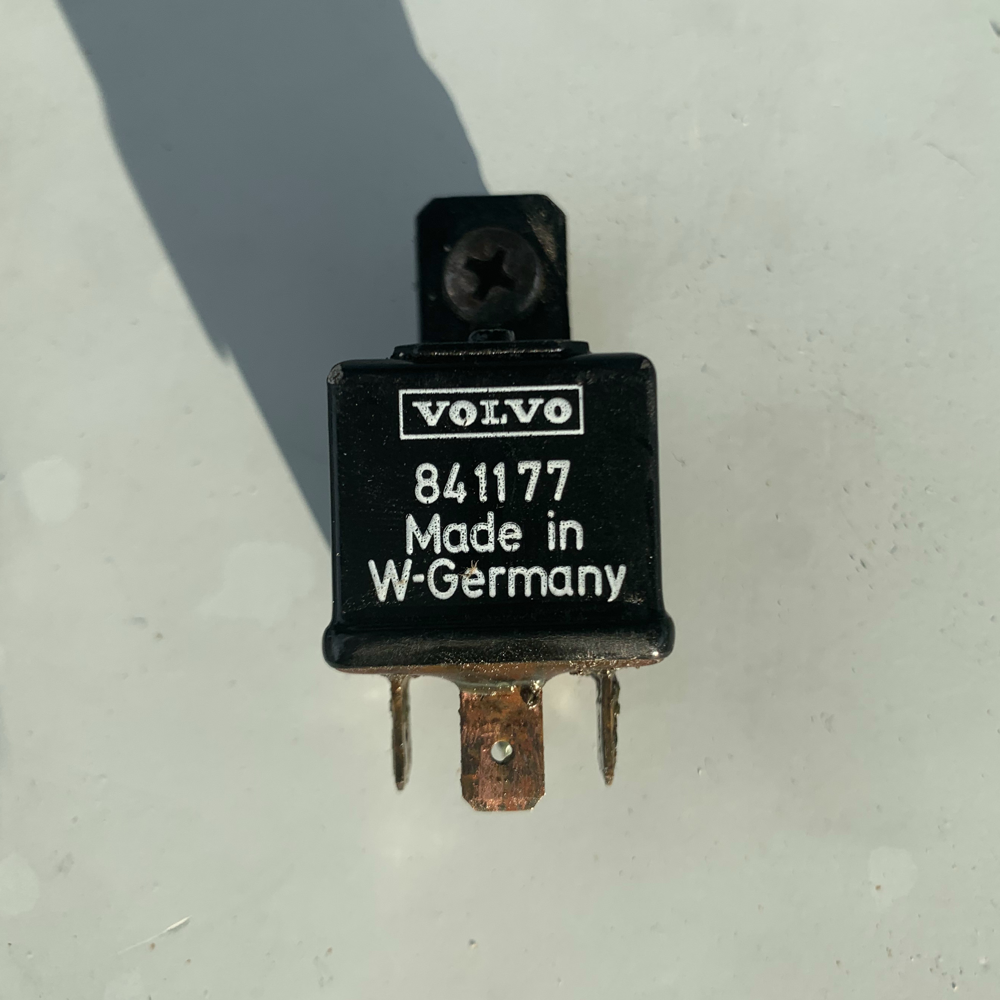

# Relay from West Germany

Ken and Julie stopped by their resort today, Ken had a bit of time to help me sort out wiring for my diesel engine, really cool guy who loves machines.  Using the panel at the helm to start the boat’s engine instead of reaching into the engine compartment is much more preferable.  Safer, faster, less embarrassing.

The wiring is a mess, all covered in oil and whatever else.  The most interesting part was a Volvo 841177 relay that has “W-Germany” written on it.  That means it’s more than 32 years old, older than me.  Tektron/TEK-composites likely bought a box of them in the 80s or the early 90s and ended up sticking them into their boats and planes that they produced in the late 90s and the early 00s.  It obviously refuses to work today, produced no clicking sound when we wanted it to.
When I tried wipind its contacts, the transparent rubbery insulation on the bottom just started crumbling like a freshly baked cookie.

Ordered a replacement from Bob & Annie’s boatyard, it should be here Monday.

The relay socket might need to get replaced as well, but first I need to get the relay to work, I rather not have to solder four old copper wires.
